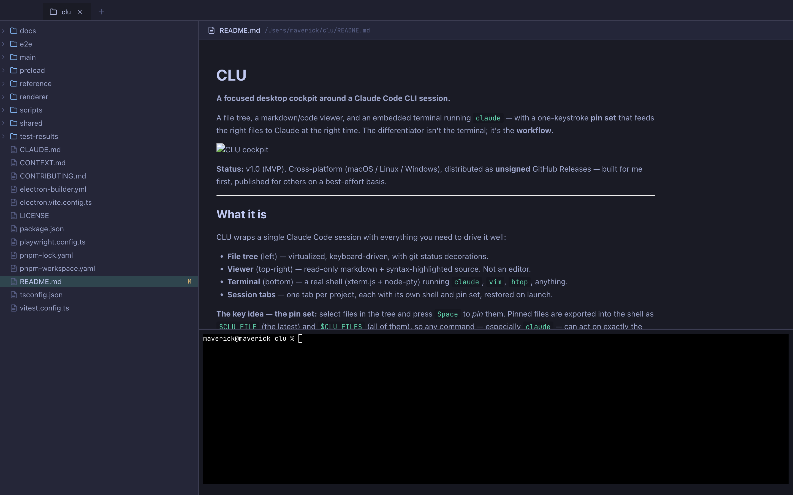

# CLU

**A focused desktop cockpit around a Claude Code CLI session.**

A file tree, a markdown/code viewer, and an embedded terminal running `claude` — with a one-keystroke **pin set** that feeds the right files to Claude at the right time. The differentiator isn't the terminal; it's the **workflow**.



> **Status:** v1.1 — cross-platform (macOS / Linux / Windows), distributed as **unsigned** GitHub Releases. Built for my own workflow first, and shared in case it's useful to you.

---

## What it is

CLU wraps a single Claude Code session with everything you need to drive it well:

- **File tree** (left) — virtualized, keyboard-driven, with git status decorations.
- **Viewer** (top-right) — read-only markdown + syntax-highlighted source. Not an editor.
- **Terminal** (bottom) — a real shell (xterm.js + node-pty) running `claude`, `vim`, `htop`, anything.
- **Session tabs** — one tab per project, each with its own shell and pin set, restored on launch.
- **Status at a glance** — every tab shows whether its Claude session is working, waiting on you, or idle. When a *background* tab gets blocked on a prompt, CLU sends a desktop notification — so with several projects open, you never have to hunt for the one that's stuck.
- **Pick up where you left off** — reopen a project and resume its previous Claude conversation in one click (`claude --resume`), so closing a tab doesn't mean losing the thread.

**The key idea — the pin set:** select files in the tree and press `Space` to *pin* them. Pinned files are exported into the shell as `$CLU_FILE` (the latest) and `$CLU_FILES` (all of them), so any command — especially `claude` — can act on exactly the files you care about:

```sh
claude "review $CLU_FILE and suggest improvements"
claude "explain how these connect: ${CLU_FILES[@]}"
```

No copy-pasting paths, no re-describing context. Pin, then talk to Claude.

## What it is *not*

- **Not a code editor** — the viewer is read-only; edit in `$EDITOR` from the terminal, or via Claude.
- **Not a multi-agent fleet manager** — one focused session, not a swarm.
- **Not an IDE / VS Code / Cursor competitor.**
- **Not a general-purpose terminal emulator.**

---

## Install

CLU is **unsigned** (no Apple Developer Program, no notarization). Installs are one extra step on macOS.

### macOS

Download `CLU-<version>-mac.zip` from the [Releases](https://github.com/MaverickHQ/CLU/releases) page, unzip, move `CLU.app` to `/Applications`, then clear the quarantine flag:

```sh
xattr -dr com.apple.quarantine /Applications/CLU.app
```

### Linux

Download the `.AppImage` from [Releases](https://github.com/MaverickHQ/CLU/releases), make it executable, and run it:

```sh
chmod +x CLU-<version>.AppImage
./CLU-<version>.AppImage
```

### Windows

Download and run the portable `CLU-<version>.exe` from [Releases](https://github.com/MaverickHQ/CLU/releases). Windows SmartScreen may warn on an unsigned binary — choose *More info → Run anyway*.

Auto-update (via GitHub Releases) is built in and works for unsigned builds.

---

## Usage

Open a project by dragging its folder onto the Welcome pane, or with the **`+`** button in the tab strip. Then:

| Action | How |
|---|---|
| Preview a file | Click it in the tree → renders in the viewer |
| **Pin / unpin a file** | Select it, press **`Space`** → appears in the Pinned section, exported to `$CLU_FILES` |
| Use pins with Claude | In the terminal: `echo $CLU_FILE`, `echo "${CLU_FILES[@]}"`, or reference them in a `claude` prompt |
| Cycle hidden files | **`.`** in the tree (default → dotfiles → all) |
| Search the terminal | **`⌘F`** / **`Ctrl+F`** |
| New project tab | **`+`** in the tab strip |

Pinned files update `$CLU_FILES` at the next shell prompt (via a shell-init hook). Works with `bash` and `zsh`; other shells fall back to typing the export at a quiet prompt.

---

## Layout

```
┌───────────────────────────────────────────────┐
│  tab strip                                     │
├──────────────┬─────────────────────────────────┤
│  file tree   │  viewer (markdown / code)       │
│  + pinned    │                                 │
│  (25%)       │                                 │
│              ├─────────────────────────────────┤
│              │  terminal (claude, shell)       │
└──────────────┴─────────────────────────────────┘
```

---

## Build from source

Requires Node ≥ 20 and [pnpm](https://pnpm.io).

```sh
git clone https://github.com/MaverickHQ/CLU
cd CLU
pnpm install
pnpm dev        # launch with hot-reload
```

Other scripts:

```sh
pnpm test       # Vitest (unit + integration, no Electron)
pnpm typecheck  # tsc --noEmit
pnpm build      # compile main/preload/renderer
pnpm e2e        # Playwright smoke suite (launches Electron)
```

**Stack:** Electron + electron-vite · React + TypeScript · xterm.js + node-pty · Zustand · react-arborist · react-markdown + shiki.

---

## Contributing

See [CONTRIBUTING.md](CONTRIBUTING.md).

## Acknowledgements

Agent status detection (per-Tab working / blocked / idle) adapts the
terminal-tail state-detection approach and Claude output patterns from
[herdr](https://github.com/herdrdev/herdr) (Apache-2.0).

## License

[MIT](LICENSE)
